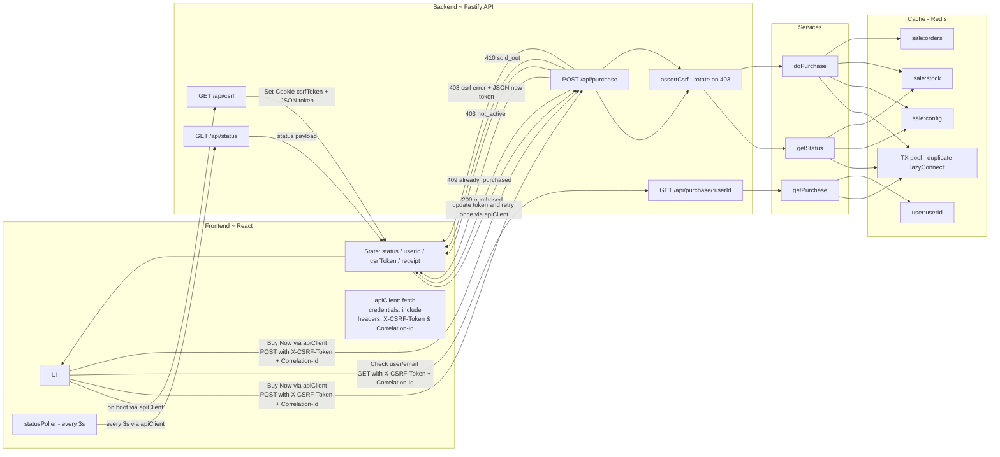

# Flash Sale (Single Product)

A simplified, production-style flash sale for one product with limited stock, one item per user, CSRF protection, and no oversell under heavy concurrency.
`Backend` uses Fastify + Redis (with a transaction connection pool).
`Frontend` is React + Vite.

Features: 
- Sale window (start/end) enforced on the server.
- Exactly-one-per-user with a dedicated Redis key per user.
- No oversell: optimistic `WATCH/MULTI/EXEC` on a pooled set of Redis connections.
- CSRF: double-submit cookie with rotation & one-retry on 403.
- Correlation-Id support on purchase requests.
- Frontend UX: status panel + live polling, "Buy Now", clear messages.
Tests: unit/integration & concurrency tests; stress tests.

# Design choices & Trade-offs

- Redis as the source of truth
I store `sale:stock (counter)`, `user:<id>` (purchase receipt), and `sale:orders` (append-only list).
  - Trade-off: No relational joins or cross-product queries-perfect for a single product flash sale.

- Optimistic concurrency with `WATCH/MULTI/EXEC`
Every purchase attempt uses a dedicated pooled connection to avoid `WATCH` collisions. I retry on EXEC=null with a tiny jitter and add a safety rollback if a negative stock ever slips through (shouldn’t happen with isolated `WATCH`).
  - Trade-off: Slightly more code, but easier to test and reason about in TS.

- CSRF double-submit
Stateless and works for SPAs. GET endpoints (e.g., `/api/status`) do not require CSRF because they’re read-only and public.
  - Trade-off: Slightly more frontend wiring (fetch token first, send header), but robust.

- Idempotency & rate limiting
The business rule (one-per-user) is naturally idempotent; an optional header gives extra protection. Rate limit is disabled in tests and stress runs.
  - Trade-off: Rate limiting can protect during real traffic but can add noise to tests.

- Frontend simplicity
SPA keeps saleState, userState, and csrfToken separately. A lightweight apiClient centralizes fetch with credentials and headers. Polls /api/status every `~3s`.
  - Trade-off: Polling is simpler than websockets and good enough for demo scale.

# System diagrams
High-level (Frontend + Backend + Redis)

# Getting started
Prereqs: 
  - Node 20+
  - Redis 6+ running locally (default: `redis://localhost:6379`)
  - Yarn / npm

How to run backend:
  - cd backend/
  - cp .env.example .env
  - yarn install 
  - yarn start

How to run frontend:
  - cd frontend/
  - cp .env.example .env
  - yarn dev 

How to run test:
 - cd backend/
 - yarn test

How to run stress test:
 - cd backend/
 - yarn start
 - yarn loadtest

or if you wanna use docker:
- docker-compose up --build